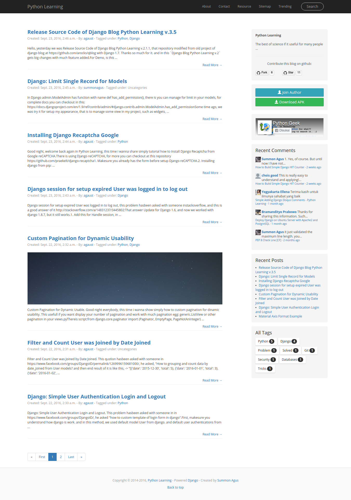
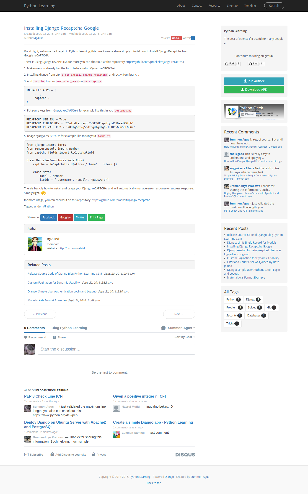
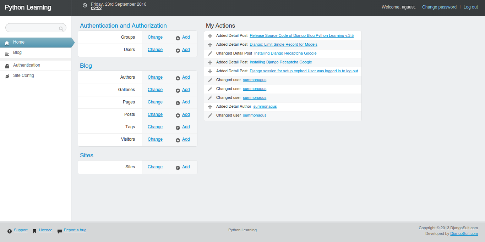
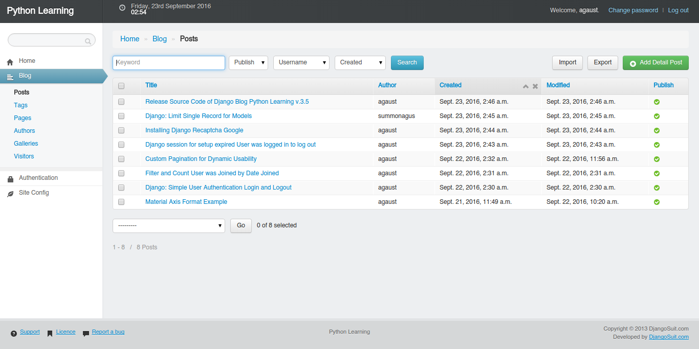
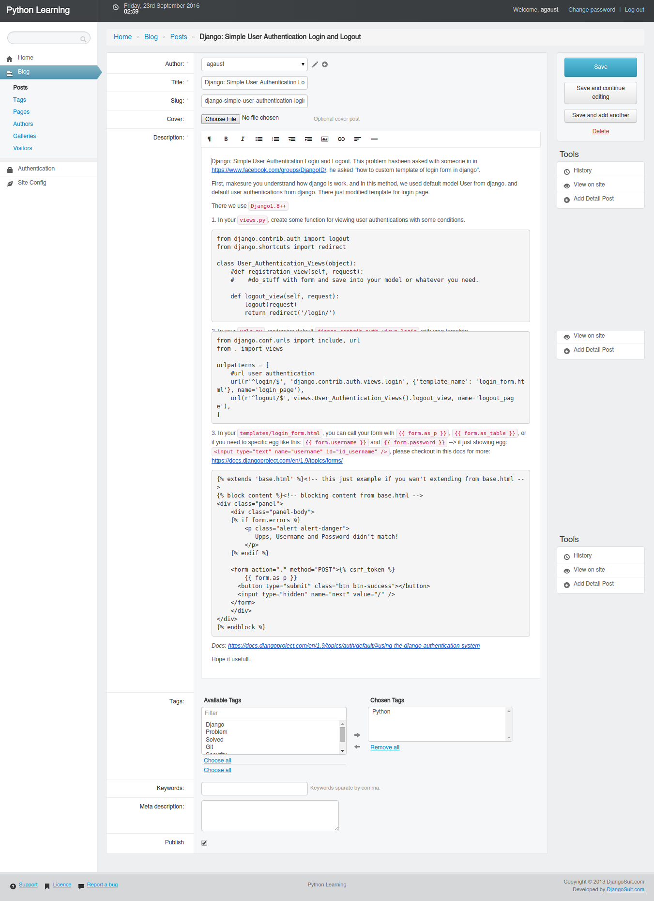
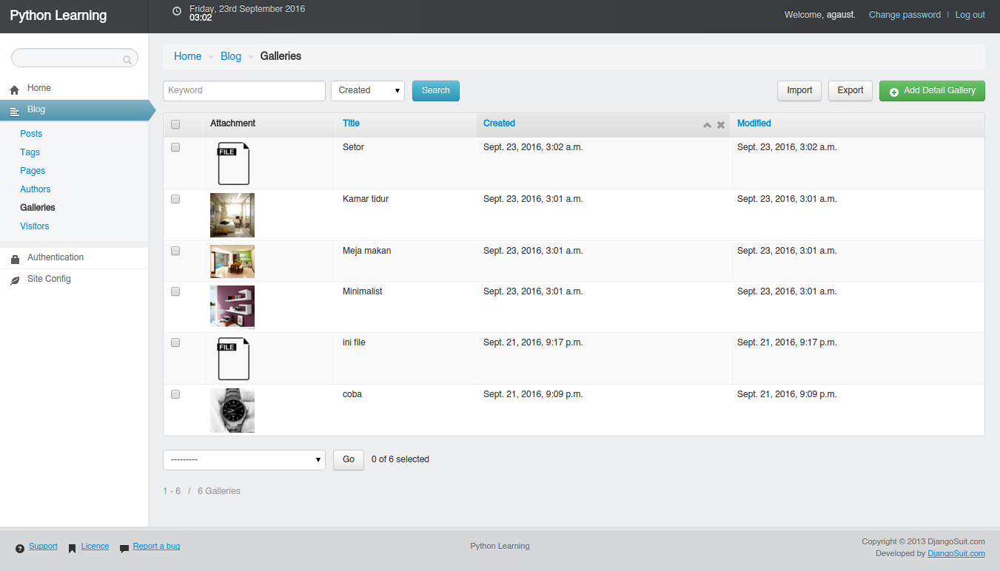

Django-Blog-Python-Learning
-------

Release Source Code of Django Blog Python Learning v.3.8

### Demo:
- [https://python.web.id](https://python.web.id)

### Technologies

- Django 1.10
- Python 3.5
- Postgresql

### Features

- Django Suit
- Django Wysiwyg Redactor
- Django disqus for comments.
- Face 90% bootstrap.
- Admin Site: User, Post, Page, Author, Tag & Gallery.
- Pagination posts, Sitemap page, Search posts page, Display posts under tags, Display posts under Author.
- Related posts
- Next and previous for post.
- sitemap.xml, feed
- Contact form.
- About author in the botom of posts.
- Visitor Counter
- Auto backup to the json file
- Json post view
- much more...

### Instalation

I assume you already setup your django development with virtual enviroment (virtualenv).

**1. Create virtual enviroment and activate it.**

```
$ virtualenv --python=/usr/bin/python3 yourenv
$ source bin/activate
```

**2. Cloning this project**

```
$ git clone git@github.com:agusmakmun/Django-Blog-Python-Learning.git
```

**3. Install all requirements**

> If you getting an error, `error: command 'i686-linux-gnu-gcc' failed with exit status 1`
> please install first the python3-dev
> using command `sudo apt-get install python3-dev` for all-deb, or use different method.
> This probelm specialy for `pip3 install psycopg2`.
> For more, please checkout this answer: http://stackoverflow.com/a/11094752/6396981

```
$ pip install -r requirements.txt
```

**4. Database migrations**

```
$ ./manage.py makemigrations
$ ./manage.py migrate
```

**5. Run the server**

```
$ ./manage.py runserver
```
-------

### Screenshot:

#### Homepage



#### Detail Post



#### Admin Dashboard _(using django suit)_



#### All Posts on the Admin Dashboard & _Included Django Import Export_



#### Tags Filter and Redactor Editor



#### Gallery File & Images



### Update and Commits

- https://github.com/agusmakmun/Django-Blog-Python-Learning/commits/master

### Stack Problem

- https://python.web.id/tag/django/
- https://github.com/agusmakmun/Some-Examples-of-Simple-Python-Script/tree/master/Django


### ChangeLog

* [CHANGELOG](CHANGELOG.md)


### License

* [GPL-2.0](LICENSE)
